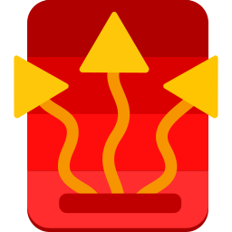
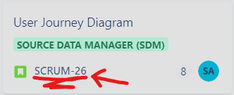

<!-- PROJECT LOGO -->
<div align="center">
  
  <h3 align="center">ProfHeat</h3>
  <p align="center">
    Optimize heat demand and electricity price integration with ease.
    <br />
    <a href="https://github.com/SP-SoftFuzz/ProfHeat"><strong>View Project »</strong></a>
    <br />
    <br />
    <a href="https://softfuzz.atlassian.net/jira/software/projects/SCRUM/boards/1/backlog">Report Bug</a>
    ·
    <a href="https://softfuzz.atlassian.net/jira/software/projects/SCRUM/boards/1/backlog">Request Feature</a>
  </p>
</div>

## About The Project 🌐

ProfHeat simplifies the integration of heat demand and electricity prices, making complex calculations and decision-making processes more straightforward. Designed for efficiency and ease of use, ProfHeat is the go-to application for optimizing your assets.

## Key Features 💡

- **Effortless Optimization:** Integrates heat demand and electricity prices quickly and accurately.
- **Sleek User Interface:** Uses FluentUI design principles for a seamless user experience.
- **Multi-Platform Compatibility:** Works smoothly across Windows, Linux, and MacOS.
- **Time-Saving:** Automates optimization to eliminate manual calculations.

## Getting Started 🚀

**Prerequisites:**
- Ensure [.NET 8.0 desktop runtime](https://dotnet.microsoft.com/en-us/download/dotnet/8.0) is installed.
- Install the Avalonia UI template for .NET by running this in your terminal:
```
dotnet new install Avalonia.Templates
```
- For editing Avalonia UI projects in Visual Studio Code, install the [Avalonia for Visual Studio Code extension](https://marketplace.visualstudio.com/items?itemName=AvaloniaTeam.vscode-avalonia).

**Installation:**
1. Download the latest release from [releases](https://github.com/SP-SoftFuzz/ProfHeat/releases/).
2. Follow the installation guide provided with the release.

## Contributing 🤝

For a smooth collaboration process, please use [GitHub Desktop](https://desktop.github.com/):
- **Note:**  Forking is creating a personal copy of the repository. It's used when you don't have write access to the repository.

1. **Clone:** Open GitHub Desktop, go to `File > Clone Repository`, and paste:
   ```
   https://github.com/SP-SoftFuzz/ProfHeat/
   ```
2. **Branch**: Switch to `main` using the branch switcher, create a new branch for your feature. Name it after the JIRA issue key and feature, e.g., `SCRUM-123-Feature`.
3. **Commit:** Enter your commit message in the `Summary (required)` field and click `Commit`.
4. **Push:** Click `Push origin` to upload your changes to GitHub.
5. **Pull Request:** On GitHub, create a `New pull request` against `main`. **Include the Jira issue key in the `title` of your pull request**, e.g., `SCRUM-123: Added feature`, fill in the details, and submit.

   

6. **Request a Review:** Tag a teammate in your pull request for a review.
7. **Stacking:** Instead of waiting for approval, continue working on another feature based on your current feature work. On your **feature branch** (not main), create a new branch `Current Branch > New Branch` for the next feature, e.g., `SCRUM-124-NextFeature`.

See [CONTRIBUTING.md](docs/CONTRIBUTING.md) for more details.

## Project Management 🗂️

- **Task Tracking:** We use [Jira](https://softfuzz.atlassian.net/jira/software/projects/SCRUM/boards/1) for all bug reports, feature requests, and overall project management.
- **Communication:** Join our [Discord server](https://discord.gg/YMfsnVVg2X) for all project discussions, updates, and daily communication.
- **Report:** Contribute to our [semester report](https://1drv.ms/w/s!Au0hUddHOg4Uju4bhCltwFKTgqUZBA?e=I5Q1P2) on OneDrive, where we document our progress and findings.

## Built With 🛠️

- [Avalonia UI](https://avaloniaui.net/) - A cross-platform XAML framework. Use Visual Studio Code with the Avalonia extension for the best development experience.

## License 📝

This project is distributed under the Apache 2.0 License. See [LICENSE](LICENSE) for more information.

## Contact 📧

For inquiries, please visit our [GitHub page](https://github.com/SP-SoftFuzz/ProfHeat).
